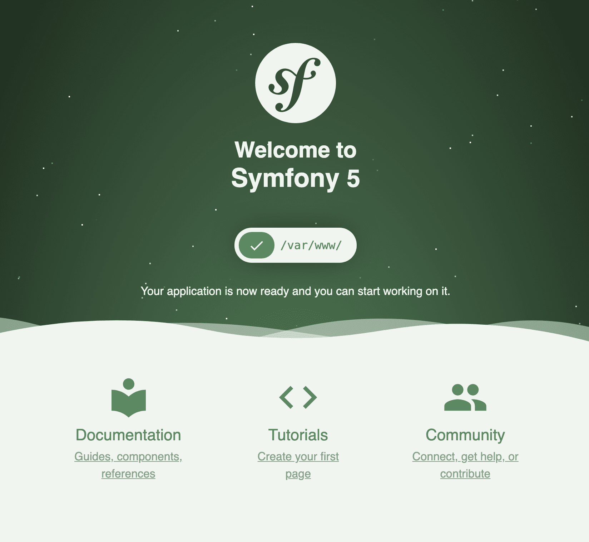

<div align="center">
    <h1 style="font-weight: bolder; margin-top: 0px" class="opacity-75">todoOnion</h1>
</div>

<div align="center">
  <p>Over engineering a todo app with thining in onion archtecture.🔥deprecated: I decided to build the real-world app in symfony framework and onion architecture. see <a href="https://github.com/vikbert/symfony-realworld-onion">symfony-realworld-onion</>
    </p>

  <p>
    <a href="#">
      
    </a>
    <a href="#">
      
    </a>
  </p>
  
</div>

---

## Starting started
Be sure you have installed `symfony CLI` on local environment, or try to install it <https://symfony.com/download>
```
cd symfony-docker-start
make init
make start
```

## Localhost URL

go to [http://localhost](http://localhost)

## licence
[apache-2.0](https://choosealicense.com/licenses/apache-2.0/)

## Maintainer
[xun.zhou@mail.schwarz](https://vikbert.github.io/)
